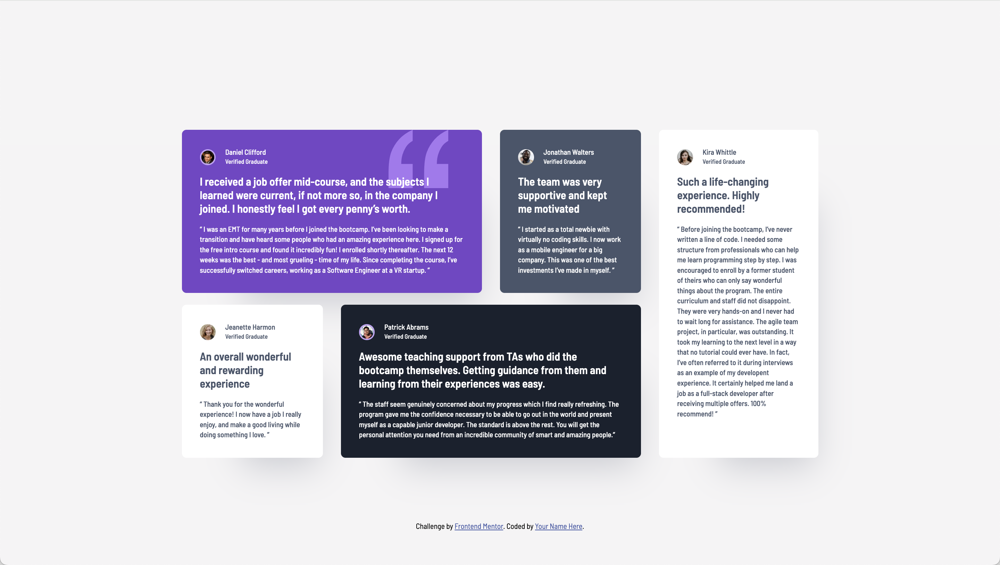

# Frontend Mentor - Testimonials grid section solution

This is a solution to the [Testimonials grid section challenge on Frontend Mentor](https://www.frontendmentor.io/challenges/testimonials-grid-section-Nnw6J7Un7). Frontend Mentor challenges help you improve your coding skills by building realistic projects.

## Table of contents

- [Overview](#overview)
  - [The challenge](#the-challenge)
  - [Screenshot](#screenshot)
  - [Links](#links)
- [My process](#my-process)
  - [Built with](#built-with)
  - [What I learned](#what-i-learned)
- [Author](#author)

**Note: Delete this note and update the table of contents based on what sections you keep.**

## Overview

### The challenge

Users should be able to:

- View the optimal layout for the site depending on their device's screen size

### Screenshot



### Links

- Solution URL: [View Solution](https://ldg.github.io/testimonials-grid-section-main/)
- Live Site URL: [View Code](https://github.com/ldg/testimonials-grid-section-main)

## My process

I started with setting up my dev environment with Sass, then creating all the folders I thought I'd need. I use folders even on this small project just to practice setting that up. After reviewing the design files and style guide, I began setting up my HTML markup. I use BEM for organizing my file and folder names, I find this works well with Sass. I start with the mobile view first since that is the simplest layout, I use Grid CSS for the avatar and bio section of the cards.

When moving on to tablet & Desktop view I start using Grid to place the cards accourding to the design files specifications.

### Built with

- Semantic HTML5 markup
- CSS custom properties
- CSS Grid
- Mobile-first workflow
- [Sass](https://sass-lang.com) - For styles

### What I learned

When setting up the cards profile section with Grid CSS I had some difficulty getting the avatar, name and status to align properly. I set up a 2 column grid for bio section, a smaller column for the avatar image, and a wider one for the Name and Status. A problem arose where the avatar and the name would share the same row, and the status was automatically added to a new row below. The problem was that I needed the avatar to span the top and bottom rows so it would vertically center beside the Name and Status wich where stacked to the right of the avatar.

Initially I thought that simply setting the Avatar image to span the top and bottom rows would center the item. However it took using `align-items: self-end` to place the avatar image.

Additionally I found that using `align-items: baseline` enabled me to get the testimonial name & status to stack with the right spacing between the two elements.

```
.testimonial__card-bio {
  display: grid;
  grid-template-columns: 2.8125rem 1fr;
  align-items: baseline;
}
.testimonial__card-avatar {
  width: 1.75rem;
  height: 1.75rem;
  border-radius: 50%;
  grid-row: 1/-3;
  align-self: self-end;
}
```

## Author

- Frontend Mentor - [@ldg](https://www.frontendmentor.io/profile/ldg)
